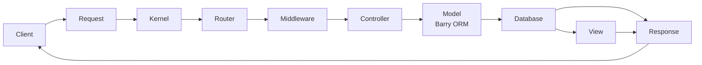

# Bow Framework

<a href="https://github.com/bowphp/docs" title="docs"></a>
<a href="https://packagist.org/packages/bowphp/framework" title="version"></a>
<a href="https://github.com/bowphp/framework/blob/master/LICENSE" title="license"></a>
<a href="https://travis-ci.org/bowphp/framework" title="Build Status"></a>

> A lightweight, modern PHP framework designed for building web applications with clean architecture and modular design.

To use this package, please create an application from this package [bowphp/app](https://github.com/bowphp/app)

## Overview

Bow Framework is a lightweight PHP framework created by Franck DAKIA that emphasizes simplicity, performance, and developer experience. It provides a comprehensive set of tools for building modern web applications with clean, maintainable code.

**Requirements:**
- PHP ^8.1+
- Composer
- Extensions: ext-ftp, ext-openssl, ext-pcntl, ext-readline, ext-pdo

**Key Highlights:**
- Modern PHP 8.1+ features (union types, attributes, named arguments)
- Modular architecture with 20+ independent components
- Lightweight and fast with minimal dependencies
- Full-stack framework with everything you need
- Well-tested with 1,110+ tests and 94% success rate
- Active development with regular updates

## Core Features

### Database & ORM
- **Barry ORM**: Lightweight ActiveRecord-style ORM
- **Query Builder**: Fluent, expressive database queries
- **Multi-database**: MySQL, PostgreSQL, SQLite support
- **Migrations**: Version control for database schema
- **Relationships**: BelongsTo, HasMany, ManyToMany
- **Pagination**: Built-in pagination support

### Routing System
- Simple, expressive routing syntax
- RESTful resource routing with automatic CRUD operations
- Route naming for easy URL generation
- Route parameters with regex constraints
- Middleware support per route or route group
- Route prefix support for grouping

### Mail System
- Multiple adapters: SMTP, AWS SES, Native PHP mail
- RFC-compliant SMTP implementation
- Email parsing with "Name <email>" format support
- File attachments
- Queue integration for asynchronous sending

### Queue System
- Multiple backends: Beanstalkd, Redis, SQS, Database, Sync
- Object-oriented job definitions
- Event-driven job queuing
- Automatic retry logic with exponential backoff
- Mail queue support

### Storage System
- Multi-driver: Local, FTP, AWS S3
- Dynamic storage adapter selection
- File operations: upload, download, copy, move, delete
- Directory management
- Efficient stream handling for large files

### Security Features
- XSS protection with automatic filtering
- CSRF token-based validation
- Data encryption utilities
- Password hashing (Bcrypt/Argon2)
- Native authentication system with guards

### Additional Features
- **Cache**: Filesystem, Redis, Database caching
- **Events**: Event management and dispatching
- **Session**: User session management
- **Validation**: Comprehensive form and data validation
- **Console**: CLI commands and generators
- **Testing**: PHPUnit integration with test utilities
- **Translation**: Internationalization support
- **View Rendering**: Tintin template engine integration
- **Middleware**: HTTP middleware stack
- **Container**: Dependency injection with auto-resolution

## Architecture

### Request Lifecycle



1. **Request arrives** at entry point
2. **Kernel loads** configurations from `config/`
3. **Router matches** URL to controller/action
4. **Middleware processes** request (auth, validation, etc.)
5. **Controller executes** business logic
6. **Model interacts** with database
7. **View renders** response (HTML/JSON)
8. **Response sent** back to client

### Design Patterns

The framework implements several design patterns:

- **Singleton**: Application, Configuration loaders
- **Factory**: Database connections, Mail adapters
- **Strategy**: Storage drivers, Queue backends
- **Observer**: Event system
- **Middleware Pattern**: HTTP request pipeline
- **Repository Pattern**: Database abstraction
- **Service Container**: Dependency injection
- **Facade Pattern**: Helper functions

## Project Structure

The project is organized into the following directories, each representing an independent module:

- **src/**: Source code for the Bow Framework.
  - **Application/**: Main application logic and configuration.
  - **Auth/**: Authentication and authorization management.
  - **Cache/**: Caching mechanisms.
  - **Configuration/**: Configuration settings management.
  - **Console/**: Console commands and utilities.
  - **Container/**: Dependency injection and service container.
  - **Contracts/**: Interfaces and contracts for various components.
  - **Database/**: Database connections and ORM.
  - **Event/**: Event management and dispatching.
  - **Http/**: HTTP requests and responses management.
  - **Mail/**: Email sending and configuration.
  - **Messaging/**: Messaging and notifications.
  - **Middleware/**: Middleware classes for request handling.
  - **Queue/**: Job queues and background processing.
  - **Router/**: HTTP request routing.
  - **Security/**: Security features like encryption and hashing.
  - **Session/**: User session management.
  - **Storage/**: File storage and retrieval.
  - **Support/**: Utility classes and helper functions.
  - **Testing/**: Unit testing classes and utilities.
  - **Translate/**: Translation and localization.
  - **Validation/**: Data validation.
  - **View/**: View rendering and templating.
- **tests/**: Unit tests for the project.

## Quick Start

### Installation

```bash
# Create a new Bow application
composer create-project bowphp/app my-app

# Navigate to the project
cd my-app

# Start the development server
php bow serve
```

### Basic Usage

**Define Routes:**

```php
// routes/app.php
$app->get('/', function () {
    return 'Hello World!';
});

$app->get('/users/:id', function ($id) {
    return "User ID: $id";
});

// RESTful resource routing
$app->rest('/api/posts', PostController::class);
```

**Create a Controller:**

```php
namespace App\Controllers;

use Bow\Http\Request;

class PostController
{
    public function index()
    {
        return Post::all();
    }

    public function store(Request $request)
    {
        return Post::create($request->all());
    }
}
```

**Work with Database:**

```php
use App\Models\User;

// Using Barry ORM
$user = User::find(1);
$users = User::where('active', true)->get();

// Using Query Builder
$users = Database::table('users')
    ->where('role', 'admin')
    ->orderBy('created_at', 'desc')
    ->paginate(10);
```

## Code Quality & Testing

### Current Status (v5.1.7)

- **Test Suite**: 1,110+ tests with 2,498+ assertions
- **Success Rate**: 94% (remaining failures are external service dependencies)
- **Code Style**: PSR-12 compliant
- **PHP Version**: 8.1+ with modern features

### Recent Improvements

The framework is actively maintained with recent major refactoring:

- **SMTP Adapter**: Complete rewrite (8 → 21 methods, RFC-compliant)  
- **FTP Service**: Enhanced with retry logic and better error handling  
- **Queue System**: Graceful logger fallback  
- **Test Quality**: 39% fewer errors, 70% fewer failures  
- **PHP 8.x**: Modernized code style (arrow functions, union types)

See [CHANGELOG.md](CHANGELOG.md) for full details.

## Use Cases

**Ideal For:**
- REST APIs and microservices
- Web applications with complex database requirements
- Applications requiring file storage (S3, FTP)
- Projects needing queue/job processing
- Multi-tenant applications
- Internationalized applications

## Ecosystem

The Bow ecosystem includes several packages:

- **[bowphp/app](https://github.com/bowphp/app)**: Application skeleton
- **[bowphp/tintin](https://github.com/bowphp/tintin)**: Template engine
- **[bowphp/policier](https://github.com/bowphp/policier)**: Authentication & authorization
- **[bowphp/slack-webhook](https://github.com/bowphp/slack-webhook)**: Slack integration
- **[bowphp/payment](https://github.com/bowphp/payment)**: Payment gateway integration

## Contributing

Thank you for considering contributing to Bow Framework! The contribution guide is in the framework documentation.

- [Franck DAKIA](https://github.com/papac)
- [Thank's collaborators](https://github.com/bowphp/framework/graphs/contributors)

### Contribution Guidelines

We welcome contributions from the community! To contribute to the project, please follow these steps:

1. Fork the project and clone it to your local machine.
2. Create a new branch for your changes.
3. Make your changes and commit them.
4. Push your changes to your fork and create a pull request.

For more detailed information, refer to the `CONTRIBUTING.md` file.

## Documentation

- [Official Documentation](https://bowphp.com)
- [API Reference](https://bowphp.com/api)
- [Tutorials & Guides](https://bowphp.com/docs)
- [Community Forum](https://bowphp.slack.com)

## Support & Community

### Get Help

- **Documentation**: [https://bowphp.com](https://bowphp.com)
- **Issues**: [GitHub Issues](https://github.com/bowphp/framework/issues)
- **Discussions**: [GitHub Discussions](https://github.com/bowphp/framework/discussions)
- **Slack**: [Join our Slack](https://join.slack.com/t/bowphp/shared_invite/enQtNzMxOTQ0MTM2ODM5LTQ3MWQ3Mzc1NDFiNDYxMTAyNzBkNDJlMTgwNDJjM2QyMzA2YTk4NDYyN2NiMzM0YTZmNjU1YjBhNmJjZThiM2Q)

### Stay Updated

- **Twitter**: [@papacdev](https://twitter.com/papacdev)
- **GitHub**: [bowphp](https://github.com/bowphp)

## License

The Bow Framework is open-source software licensed under the [MIT license](LICENSE).

## Credits

**Created and maintained by:**
- [Franck DAKIA](https://github.com/papac) - Lead Developer

**Special thanks to:**
- [All contributors](https://github.com/bowphp/framework/graphs/contributors)
- The PHP community

## Contact

- Email: [papac@bowphp.com](mailto:papac@bowphp.com)  
- Twitter: [@papacdev](https://twitter.com/papacdev)

For bug reports, please use [GitHub Issues](https://github.com/bowphp/framework/issues).  
For questions and discussions, join us on [Slack](https://bowphp.slack.com).

---

**Made with love by the Bow Framework Team**

