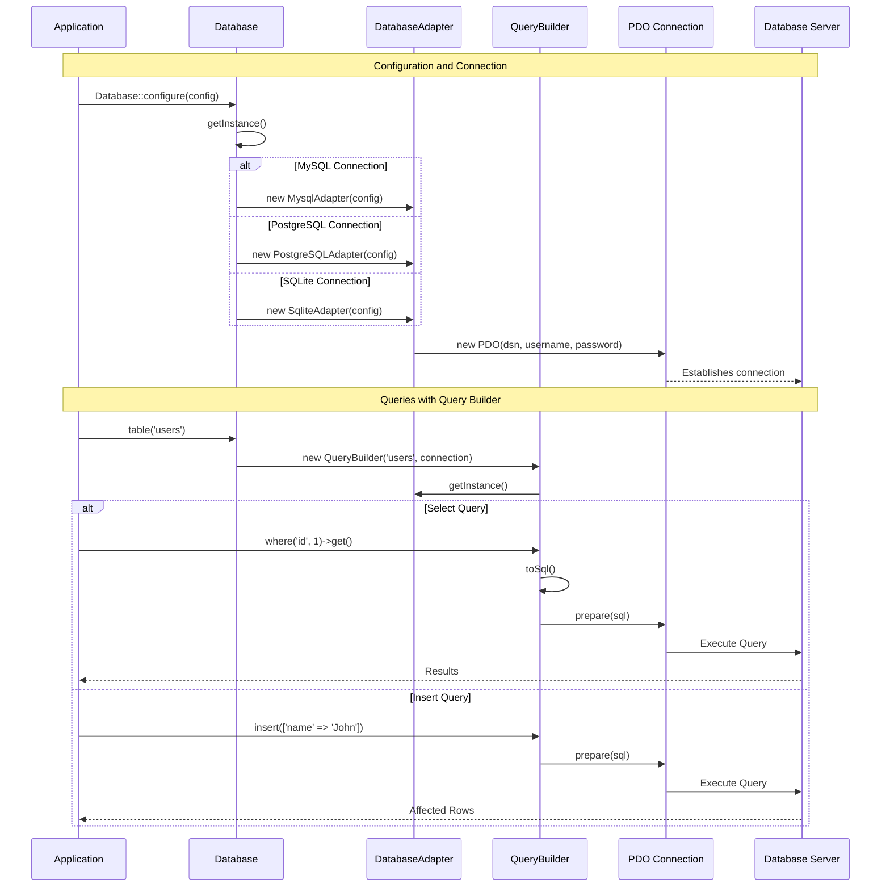

# Bow Database

Bow Framework's database system is very simple database manager api with support:

- MySQL
- PostGreSQL
- SQLite

Make database connexion is very simple

```php
use Bow\Database\Database;

// Configure the database
Database::configure([
    "fetch" => PDO::FETCH_OBJ,
    "default" => "mysql",
    "connection" => [
        "mysql" => [
            "driver" => "mysql",
            "hostname" => getenv("MYSQL_HOSTNAME"),
            "username" => getenv("MYSQL_USER"),
            "password" => getenv("MYSQL_PASSWORD"),
            "database" => getenv("MYSQL_DATABASE"),
            "charset"  => getenv("MYSQL_CHARSET"),
            "collation" => getenv("MYSQL_COLLATE") ? getenv("MYSQL_COLLATE") : "utf8_unicode_ci",
            "port" => 3306,
            "socket" => null
        ],
        "sqlite" => [
            "driver" => "sqlite",
            "database" => ":memory:",
            "prefix" => "table_prefix"
        ],
        'pgsql' => [
            'driver' => 'pgsql',
            'hostname' => app_env('DB_HOSTNAME', 'localhost'),
            'username' => app_env('DB_USERNAME', 'test'),
            'password' => app_env('DB_PASSWORD', 'test'),
            'database' => app_env('DB_DBNAME', 'test'),
            'charset'  => app_env('DB_CHARSET', 'utf8'),
            'prefix' => app_env('DB_PREFIX', ''),
            'port' => app_env('DB_PORT', 3306)
        ],
    ]
]);
```

Let's show a little example:

```php
use Bow\Database\Database;

$users = Database::select("select * from users");
```

From model example:

```php
use App\Models\User as UserModel;

$users = UserModel::all();
```

## Diagramme de séquence



Is very enjoyful api
