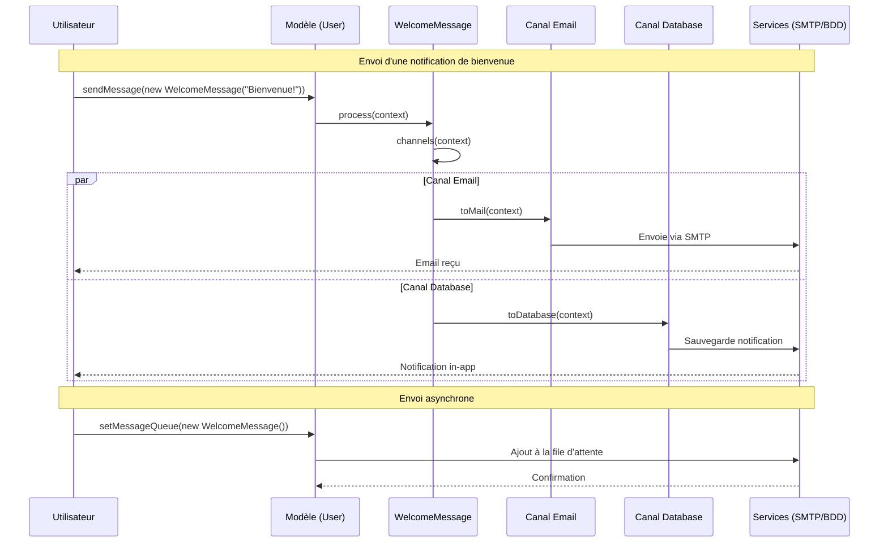

# Bow Framework - Messaging System

Le système de messaging de Bow Framework permet d'envoyer des notifications à travers différents canaux (email, base de
données, etc.) de manière simple et flexible.

## Utilisation basique

### 1. Créer un Message

```php
<?php

namespace App\Messages;

use Bow\Database\Barry\Model;
use Bow\Mail\Envelop;
use Bow\Messaging\Messaging;

class WelcomeMessage extends Messaging
{
    /**
     * Définir les canaux de diffusion du message
     */
    public function channels(Model $context): array
    {
        return ['mail', 'database'];
    }

    /**
     * Configuration du message pour l'envoi par email
     */
    public function toMail(Model $context): Envelop
    {
        return (new Envelop())
            ->to($context->email)
            ->subject('Bienvenue sur notre plateforme')
            ->view('emails.welcome', [
                'user' => $context
            ]);
    }

    /**
     * Configuration du message pour la sauvegarde en base de données
     */
    public function toDatabase(Model $context): array
    {
        return [
            'type' => 'welcome_message',
            'data' => [
                'user_id' => $context->id,
                'message' => 'Bienvenue sur notre plateforme !'
            ]
        ];
    }
}
```

### 2. Envoyer un Message

```php
// Envoi synchrone
$user->sendMessage(new WelcomeMessage());

// Envoi asynchrone (file d'attente)
$user->setMessageQueue(new WelcomeMessage());

// Envoi différé
$user->sendMessageLater(3600, new WelcomeMessage()); // Délai en secondes

// Envoi sur une file d'attente spécifique
$user->sendMessageQueueOn('high-priority', new WelcomeMessage());
```

## Configuration

Pour utiliser le système de messaging, assurez-vous que votre modèle implémente le trait `CanSendMessage` :

```php
use Bow\Messaging\Message;
use Bow\Database\Barry\Model;

class User extends Model
{
    use CanSendMessage;
    
    // ...
}
```

## Canaux disponibles

- `mail` : Envoi par email
- `database` : Stockage en base de données
- `sms` : Envoi par SMS avec Twilio
- `slack` : Envoi par Slack
- `telegram` : Envoi par Telegram
- Possibilité d'ajouter des canaux personnalisés

## Bonnes pratiques

1. Créez un message par type de notification
2. Utilisez les files d'attente pour les notifications non urgentes
3. Personnalisez les canaux en fonction du contexte
4. Utilisez les vues pour les templates d'emails 

## Exemple de configuration


