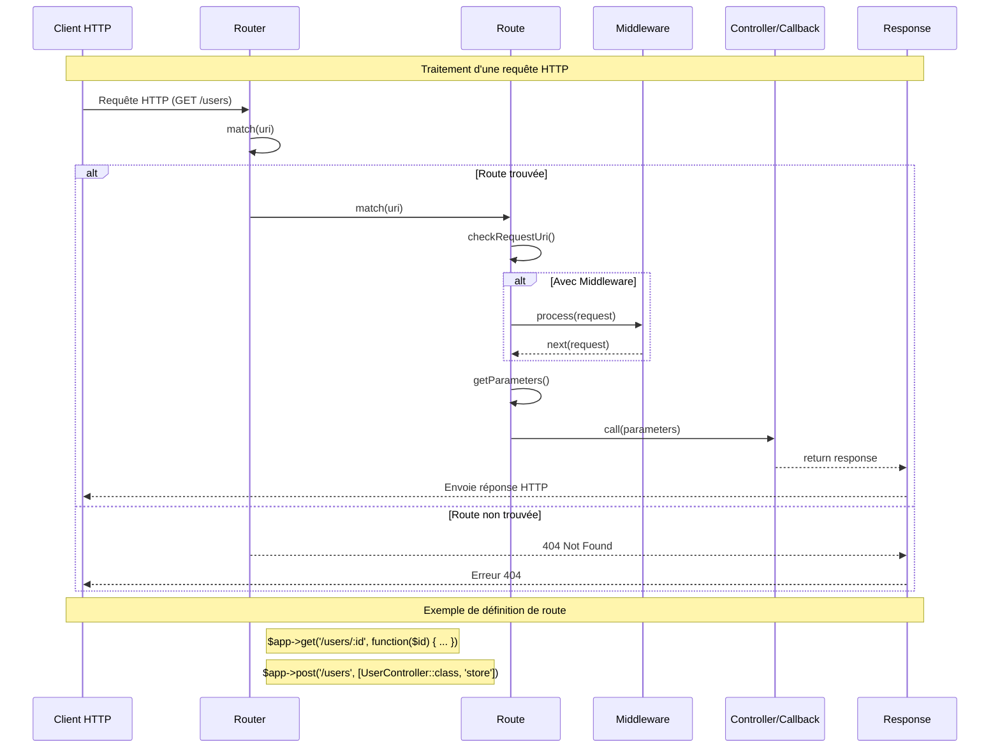

# Bow Router

Bow Framework's routing system is very simple with:

- Route naming support
- Route prefix support
- Route parameter catcher support

Let's show a little exemple:

```php
$app->get('/', function () {
    return "Hello guy!";
});
```

## Diagramme de flux du routage



Is very joyful api
