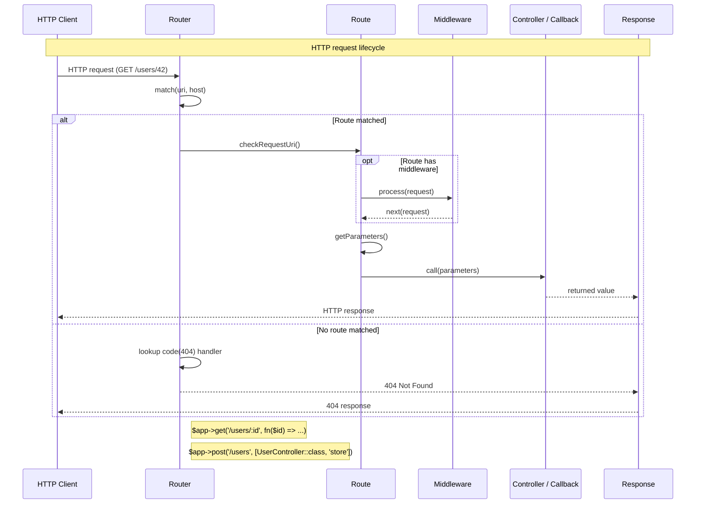

# Bow Router

Bow Framework's routing system is small, expressive, and PHP 8 attribute-aware:

- HTTP verb helpers (`get`, `post`, `put`, `patch`, `delete`, `options`, `any`, `match`)
- Named routes, URL parameters and `where` constraints
- Route groups via `prefix()` and `domain()`
- Per-route and per-group middleware
- Attribute-driven controllers (`#[Controller]`, `#[Get]`, `#[Post]`, ...)
- Custom HTTP error handlers via `code()`

## Quick start

```php
$app->get('/', fn() => 'Hello guy!');

$app->get('/users/:id', fn(int $id) => User::find($id))
    ->where('id', '\d+')
    ->name('users.show');

$app->post('/users', [UserController::class, 'store'])
    ->middleware(['auth', 'throttle:60,1']);
```

## Groups

Share a prefix, middleware, or domain across many routes:

```php
$app->prefix('/admin', function () use ($app) {
    $app->get('/dashboard', [AdminController::class, 'index'])->name('admin.dashboard');
    $app->get('/users',     [AdminController::class, 'users']);
})->middleware('admin');

$app->domain('{tenant}.example.com', function () use ($app) {
    $app->get('/', [TenantController::class, 'show']);
});
```

## Attribute-based controllers

Declare routing directly on the controller class — no central route file required:

```php
use Bow\Router\Attributes\{Controller, Get, Post};

#[Controller(prefix: '/api/users', middleware: ['auth'], name: 'users.')]
final class UserController
{
    #[Get('/', name: 'index')]
    public function index() { /* ... */ }

    #[Get('/:id', name: 'show')]
    public function show(int $id) { /* ... */ }

    #[Post('/', name: 'store')]
    public function store(Request $request) { /* ... */ }
}

$app->register(UserController::class);
// — or pass an array of controllers to register a batch.
```

`#[Get]`, `#[Post]`, `#[Put]`, `#[Patch]`, `#[Delete]`, `#[Options]`, and the
generic `#[Route(methods: [...])]` are all available and repeatable, so a single
method can serve multiple verbs / paths.

## Custom error handlers

```php
$app->code(404, fn() => view('errors.404'));
$app->code(500, [ErrorController::class, 'serverError']);
```

## Request flow


```mermaid
sequenceDiagram
    participant Client as HTTP Client
    participant Router
    participant Route
    participant Middleware
    participant Handler as Controller / Callback
    participant Response

    Note over Client,Response: HTTP request lifecycle

    Client->>Router: HTTP request (GET /users/42)
    Router->>Router: match(uri, host)

    alt Route matched
        Router->>Route: checkRequestUri()
        opt Route has middleware
            Route->>Middleware: process(request)
            Middleware-->>Route: next(request)
        end
        Route->>Route: getParameters()
        Route->>Handler: call(parameters)
        Handler-->>Response: returned value
        Response-->>Client: HTTP response
    else No route matched
        Router->>Router: lookup code(404) handler
        Router-->>Response: 404 Not Found
        Response-->>Client: 404 response
    end

    Note right of Router: $app->get('/users/:id', fn($id) => ...)
    Note right of Router: $app->post('/users', [UserController::class, 'store'])
```

Is very joyful api.
